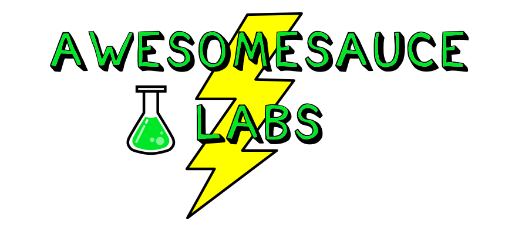
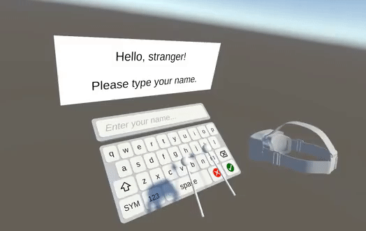

## About Awesomesauce

Thanks for visiting! I'm an indie programmer that develops 3D/VR applications with [Unity](https://unity.com/).  You can contact me at [awesomesaucelabs@gmail.com](mailto:awesomesaucelabs@gmail.com).

## VRKB: Virtual Reality Keyboard

My first product is VRKB, a Unity asset that facilitates text entry in VR applications:

VRKB manual: <https://awesomesaucelabs.github.io/vrkb-manual>
 
VRKB bug tracker: <https://github.com/AwesomesauceLabs/vrkb-manual/issues>
 
VRKB setup video: <https://www.youtube.com/watch?v=J1dHujWH23s> 

